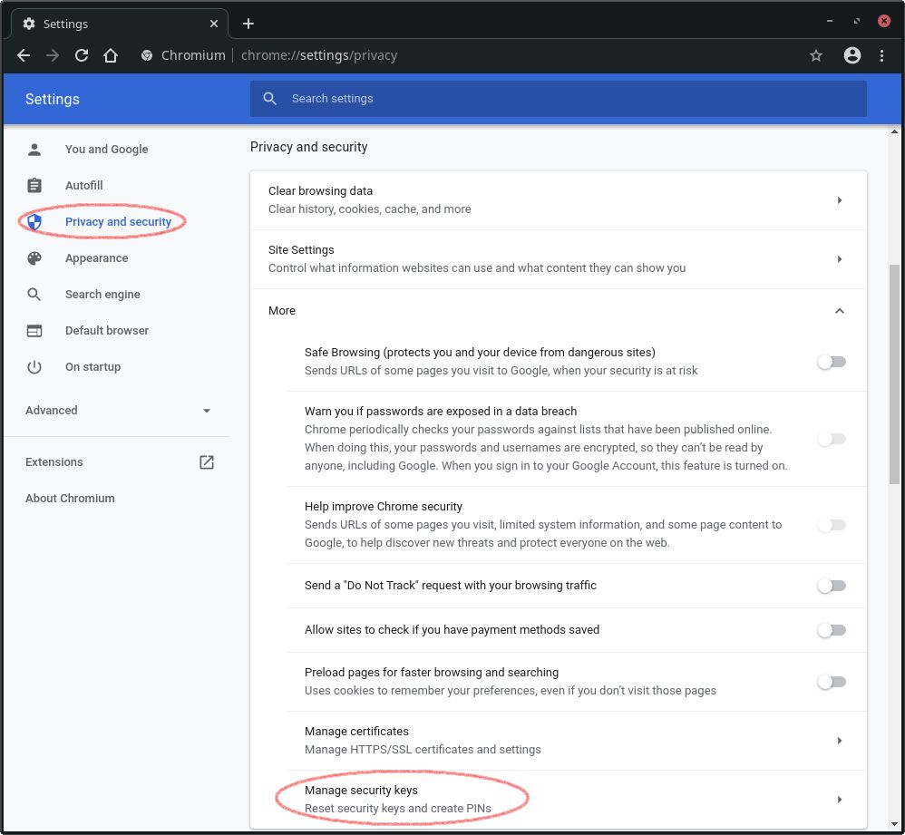
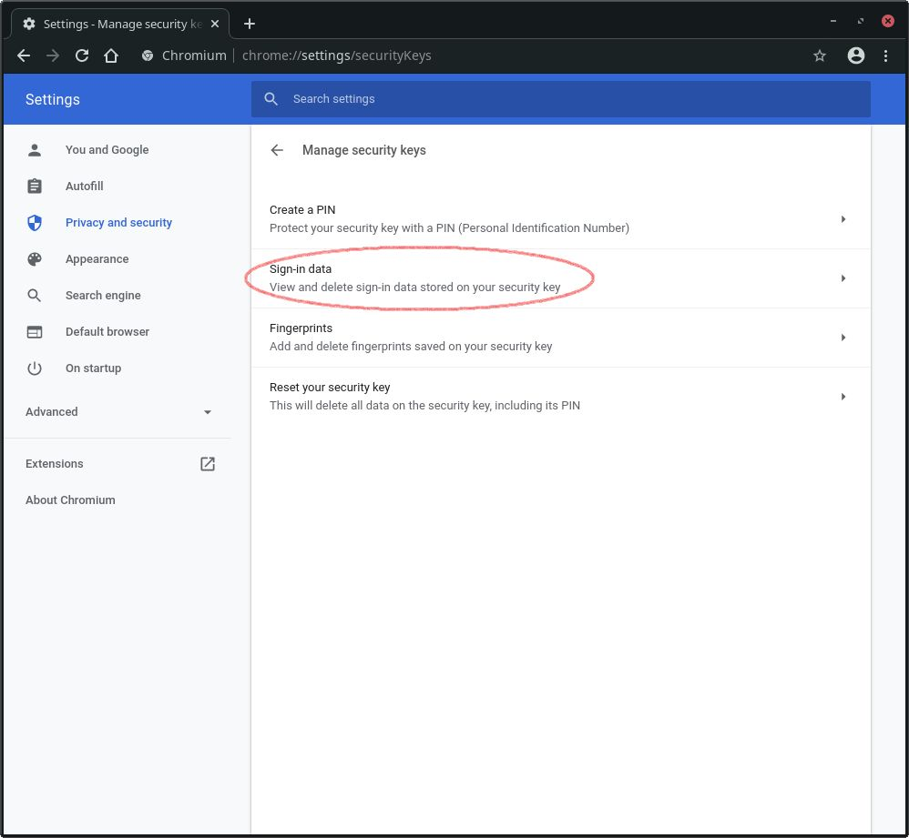

# webauthn-js-demo: A demo project

This a demo implementation of [webauthn](https://www.w3.org/TR/webauthn/) by using the [webauthn-js](https://github.com/frenatix/webauthn-js) lib.

## Quickstart

### Clone git repo
```sh
git clone https://github.com/frenatix/webauthn-js-demo.git
```

### Install dependencies
```sh
npm i
```

### Start web server
```sh
npm start
```

### Open browser
The webauthn demo is running under [http://localhost:3001](http://localhost:3001)

## About this demo

### Database
The webauthn credentials are saved in a Sqlite-DB named `webauthn-js.db`. Delete this file if you want to reset the database.

### Name-less Login

### Manage the resident keys
If you want to delete the residents keys on your usb authenticator, go to Chrome/Chromium ["Settings" -> "Privacy and security" -> "Manage security keys"](chrome://settings/securityKeys).


Then go to "Sign-in data". You will be asked to insert your usb authenticator and the pin. Afterwards you will see all the resident keys.

